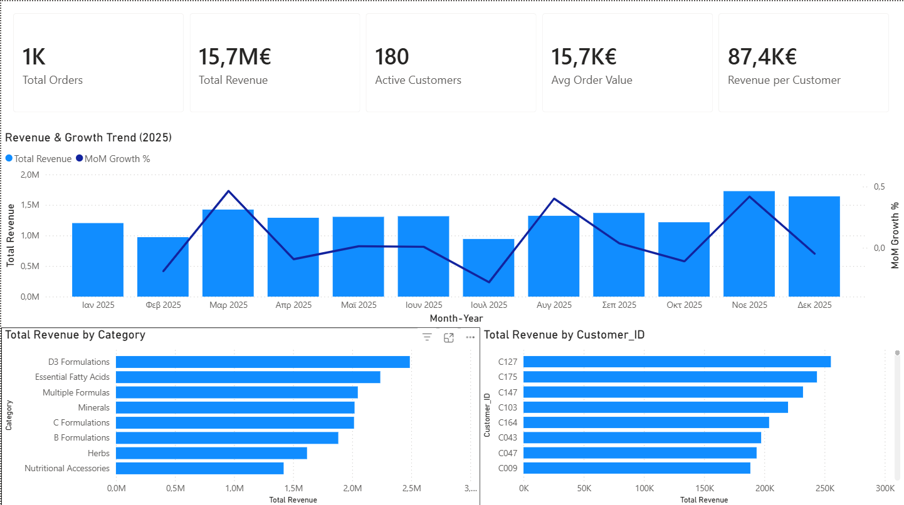
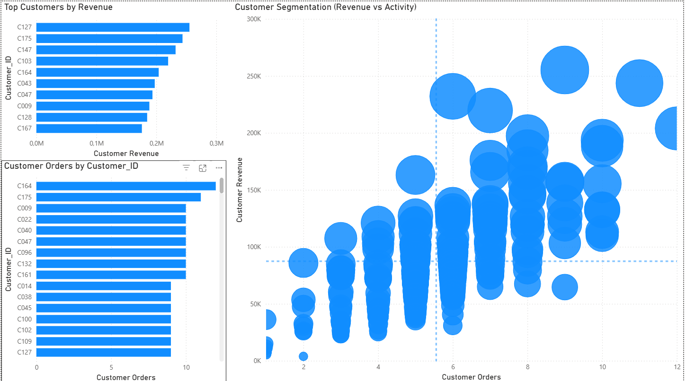
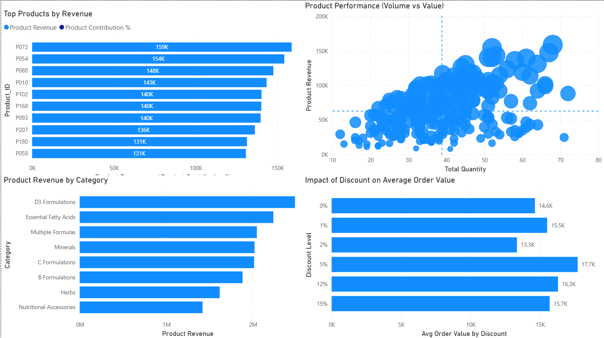

# Pharma Sales Analytics Dashboard

## 📌 Project Overview

This project presents an end-to-end sales analytics solution built in Power BI using synthetic but business-realistic pharmaceutical and dietary supplements sales data.

The dashboard focuses on:
- Revenue performance
- Customer segmentation
- Product analysis
- Discount effectiveness
- Business insights generation

---

# 🛠️ Tools Used

- Power BI
- DAX
- Data Modeling
- Business Intelligence concepts
- CSV / Excel datasets

---

# 📊 Dashboard Pages

## 1️⃣ Executive Overview

Focus:
- Revenue trends
- Month-over-Month Growth
- Category performance
- Top customers

### Dashboard Preview



### Key Insights
- Revenue fluctuates throughout the year
- Growth trends vary significantly month-to-month
- Revenue is concentrated among top customers

---

## 2️⃣ Customer Analysis

Focus:
- Customer segmentation
- Customer activity
- Revenue concentration

### Dashboard Preview



### Key Insights
- A small number of customers generates a large share of revenue
- Customer behavior varies significantly
- Frequent buyers do not always generate the highest revenue

---

## 3️⃣ Product Analysis

Focus:
- Product performance
- Product segmentation
- Category contribution
- Discount impact analysis

### Dashboard Preview



### Key Insights
- Revenue is concentrated among a limited number of products
- Products serve different business roles (volume vs revenue drivers)
- Moderate discount levels appear more effective than aggressive discounting

---

# 📂 Repository Structure

```text
pharma-sales-analytics-dashboard/
│
├── dashboard/
│   ├── pharma_sales_dashboard.pbix
│   └── images/
│       ├── executive_overview.png
│       ├── customer_analysis.png
│       └── product_analysis.png
│
├── data/
│
└── README.md
```

---

# 🧠 Business Value

This project demonstrates how analytics can support:
- Customer segmentation
- Revenue optimization
- Product strategy
- Pricing decisions
- Commercial performance monitoring

---

# 🚀 Future Improvements

Potential future extensions:
- Market Basket Analysis
- Predictive Sales Forecasting
- Customer Lifetime Value (CLV)
- RFM Segmentation
- Inventory Analytics

---

# 👤 Author

Paschalis Angelopoulos

- MSc Data Science & Machine Learning — Hellenic Open University
- Background in pharmaceutical & supplements sales
- Focus on Business Analytics and Data Science

GitHub: https://github.com/pasxalisag
